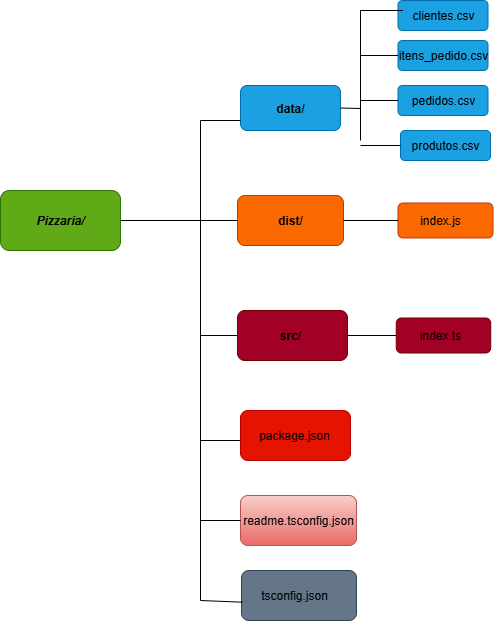

🍕 Sistema de Gestão para Pizzaria (TypeScript + Node.js)
Aplicativo CLI (linha de comando) para gerenciar Clientes, Produtos e Pedidos de uma pizzaria. Todos os dados são persistidos em arquivos CSV, tornando-o um ótimo projeto para praticar lógica de programação, manipulação de arquivos e a organização de um projeto com TypeScript.

✨ Recursos
    *Gestão de Clientes:* Cadastra nome e contato, com IDs sequenciais.
    *Gestão de Produtos:* Cadastra nome e preço dos itens do cardápio.
    *Realização de Pedidos:* Associa um pedido a um cliente já cadastrado.

        Permite adicionar múltiplos produtos e suas respectivas quantidades.
         Calcula o valor total do pedido automaticamente.
        Oferece opções de forma de pagamento.

Persistência de Dados: Todos os registros são salvos em arquivos .csv ao sair e carregados ao iniciar o programa, garantindo que nenhuma informação seja perdida.

Criação automática de pastas e arquivos de dados na primeira execução.

📁 Estrutura de Pastas
    A estrutura do projeto foi organizada para separar o código-fonte (src), o código compilado (dist) e os dados (data).
    
    SistemaPizzaria/
    ├─ dist/          # Arquivos .js compilados pelo TypeScript
    ├─ src/           # Código-fonte .ts (ex.: src/index.ts)
    ├─ data/          # Base de dados gerada em CSV
    ├─ node_modules/  # Dependências do projeto
    ├─ package.json   # Configurações do projeto e scripts
    └─ tsconfig.json  # Configurações do compilador TypeScript
    
    
    

🗃️ Arquivos CSV Gerados
    O sistema gera e gerencia quatro arquivos CSV para armazenar os dados de forma relacional.
    
    data/clientes.csv → id,nome,contato
    
    data/produtos.csv → id,nome,preco
    
    data/pedidos.csv → id,cliente_id,total,formaPagamento
    
    data/itens_pedido.csv → pedido_id,produto_id,quantidade

🔧 Pré-requisitos
    Node.js v16+ (recomendado v18 ou v20)
    
    Git
    
    🚀 Instalação e Configuração
    Na raiz do projeto (onde está o package.json), siga os passos:

Clone o repositório:

    git clone [https://github.com/alvesryan/Pizza.git](https://github.com/alvesryan/Pizza.git)
    cd Pizza

Instale as dependências:    

    npm install

Confira os scripts no package.json:

    {
      "scripts": {
        "build": "tsc",
        "start": "node dist/index.js"
      }
    }

Confira o tsconfig.json para garantir que o compilador funcione corretamente:

    {
      "compilerOptions": {
        "target": "ES2020",
        "module": "commonjs",
        "outDir": "./dist",
        "rootDir": "./src",
        "strict": true,
        "esModuleInterop": true,
        "skipLibCheck": true,
        "forceConsistentCasingInFileNames": true
      },
      "include": [
        "src/**/*"
      ]
    }

▶️ Como Executar
    Você pode rodar o projeto de duas formas:
    Compilando e executando o JavaScript (modo "produção"):
    Este é o método padrão. Primeiro, o código TypeScript é compilado, depois o resultado é executado.
    npm run build && npm run start
    Modo de desenvolvimento (requer ts-node):
    Se quiser executar o TypeScript diretamente sem compilar antes (ótimo para testar mudanças rápidas), instale o ts-node:
    
    npm install -D ts-node

Adicione o script "dev" ao seu package.json:
    
      "scripts": {
        "build": "tsc",
        "start": "node dist/index.js",
        "dev": "ts-node src/index.ts"
      }

Agora, basta rodar:
    npm run dev

🖥️ Uso (Menu do Console)
    Ao iniciar, o sistema apresenta um menu interativo:
    Cadastrar cliente: Pede nome e contato do novo cliente.
    Buscar clientes: Lista todos os clientes cadastrados com id, nome e contato.
    Cadastrar produto: Pede nome e preço do novo item do cardápio.
    Buscar produtos: Lista todos os produtos com id, nome e preço.
    Realizar um pedido: Inicia o fluxo de criação de um novo pedido, pedindo o ID do cliente e os produtos desejados.
    Sair: Salva todas as alterações feitas nos arquivos .csv e encerra o programa.

📝 Campos e Formatos
    IDs: number (inteiro), gerado sequencialmente.
    Preço e Total: number, armazenado como decimal (ex: 59.90).
    Contato: number.
    Forma de Pagamento: string (ex: "Pix", "Dinheiro", "Crédito", "Débito").

